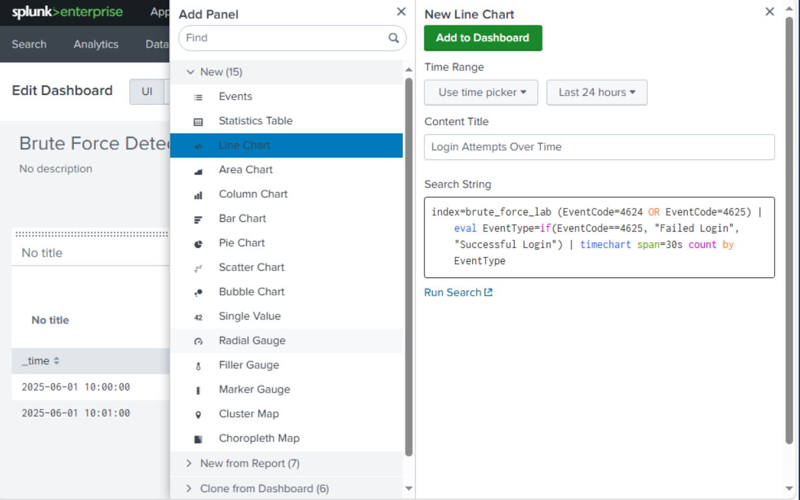
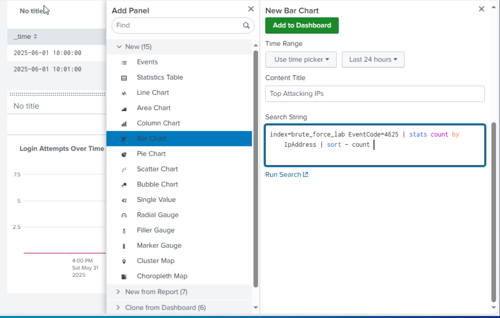
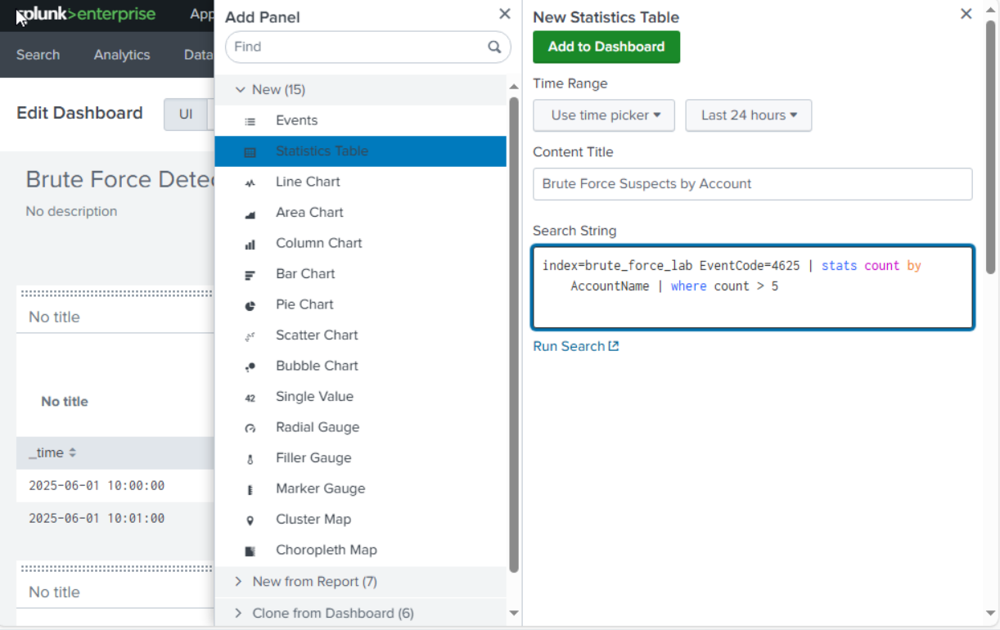
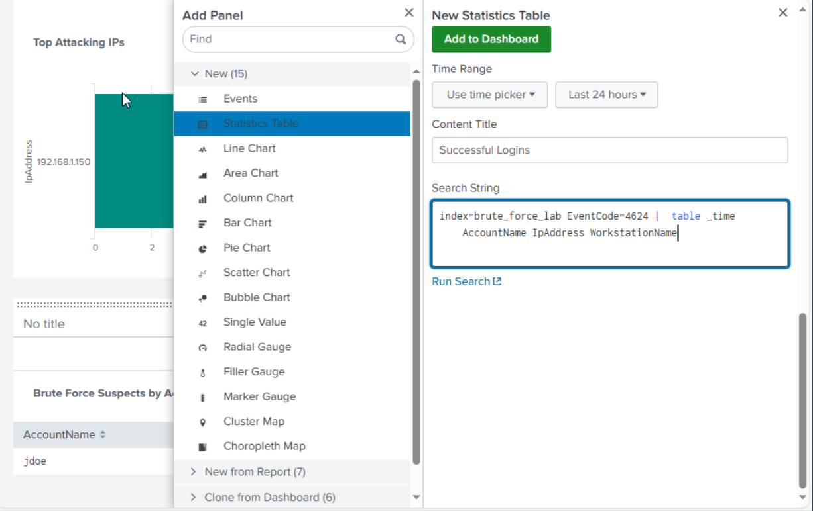
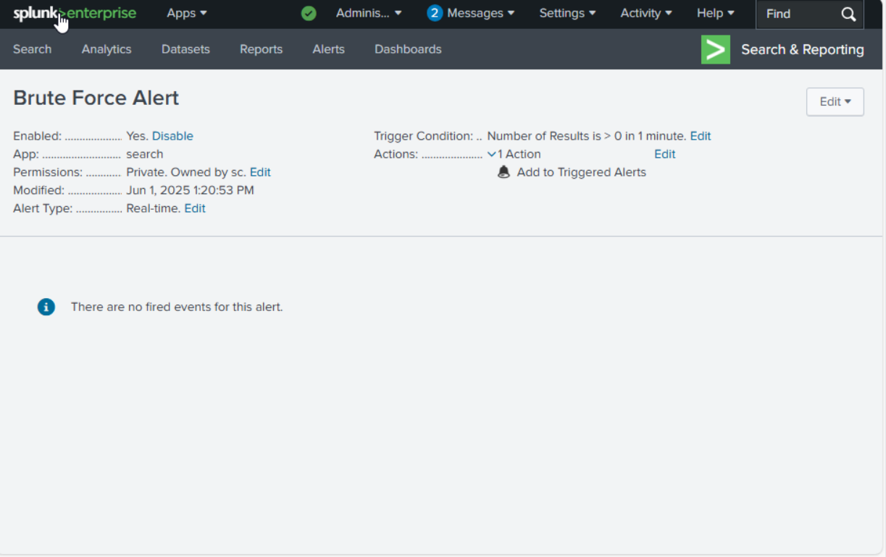

# Brute Force Detection Lab – Splunk SIEM

## 👤 Author
Shaun Carrillo  
Entry-Level Information Security Analyst | SIEM | Traffic Analysis | Incident Response  
🔗 [LinkedIn](https://linkedin.com/in/shaun-carrillo) | 🌐 [ePortfolio](https://carrillocybercom.wordpress.com/)

---

## Project Objective
This lab demonstrates how to detect brute force login attempts in a Windows environment using Splunk. I created a synthetic Windows Security Event Log, ingested it into Splunk, and built custom dashboards and alerts to identify suspicious authentication behavior.

---

## Tools & Technologies
-  **Splunk Free Tier (Local Instance)**
-  **Synthetic Log File** (`synthetic_brute_force.log`)
-  **Windows Server 2022** (Simulated via VirtualBox)
-  **Event IDs Used**: `4624` (Successful Logon), `4625` (Failed Logon)

---

## Setup Overview

1. Created a synthetic `.log` file with 20 failed and 1 successful login attempt.
2. Uploaded the log into Splunk and assigned it to a custom index: `brute_force_lab`
3. Built a dashboard to visualize login patterns and possible brute force attacks.
4. Configured a simple alert for excessive failed login attempts.


---

## Key SPL Queries Used

### Login Attempts Over Time
```spl
index=brute_force_lab (EventCode=4624 OR EventCode=4625)
| eval EventType=if(EventCode==4625, "Failed Login", "Successful Login")
| timechart span=30s count by EventType

```


### Top Attacking IPs
```spl
index=brute_force_lab EventCode=4625
| stats count by IpAddress
| sort -count
```


### Brute Force Targets by Account
```spl
index=brute_force_lab EventCode=4625
| stats count by AccountName
| where count > 5
```


### Successful Login Table
```spl
index=brute_force_lab EventCode=4624
| table _time AccountName IpAddress WorkstationName
```

---

## Dashboard Panels Built

| Panel Title              | Description                                        |
|--------------------------|----------------------------------------------------|
| Login Attempts Over Time | Line chart of failed vs. successful logins         |
| Top Attacking IPs        | Bar chart of IPs with the most failed logins       |
| Brute Force Targets      | Accounts hit by repeated failures (>5)             |
| Successful Logins        | Table view of valid logins and origin details      |

---

## Alert Logic (Optional)
```spl
index=brute_force_lab EventCode=4625
| stats count by IpAddress
| where count > 10
```
Triggers if any IP exceeds 10 failed logins within a short window.


---

## Takeaways
- Learned how to interpret and parse structured event data using Splunk
- Built SPL queries to detect login-based anomalies
- Gained hands-on experience with dashboards and alerting
- Practiced correlation of Event IDs 4624 and 4625 to spot brute force attacks

---
